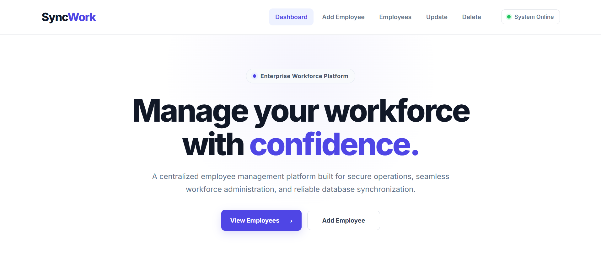
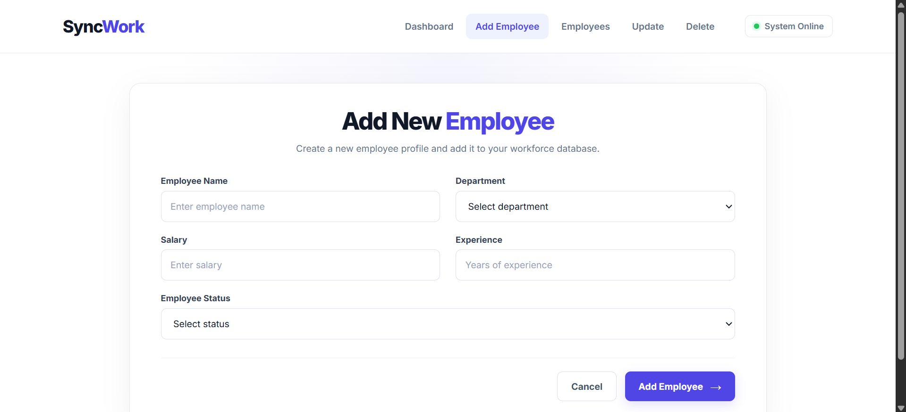
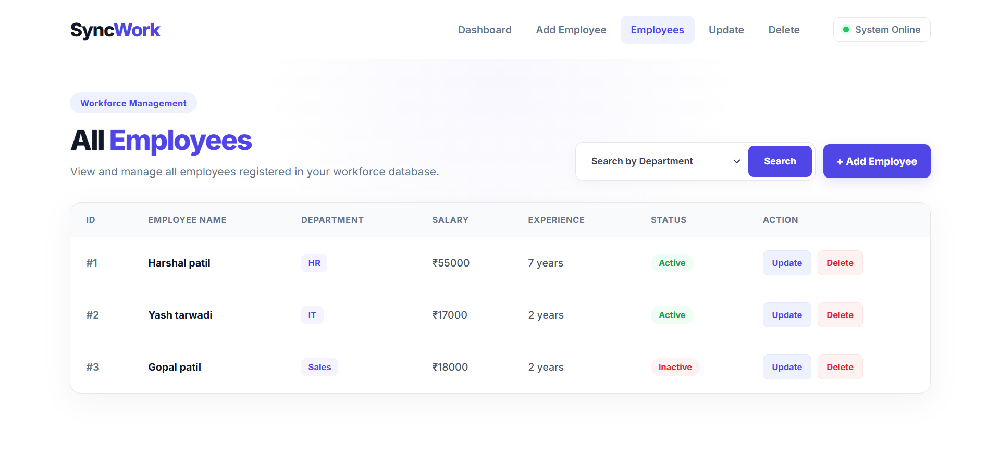
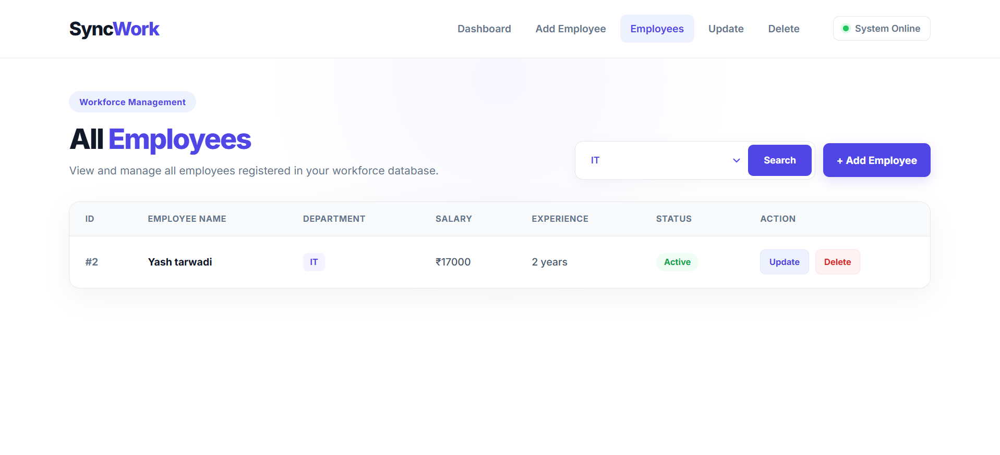
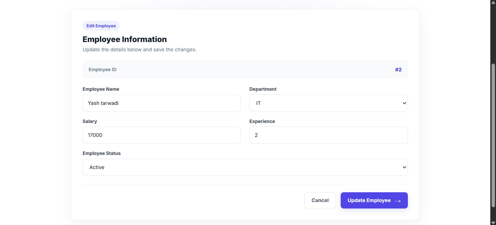
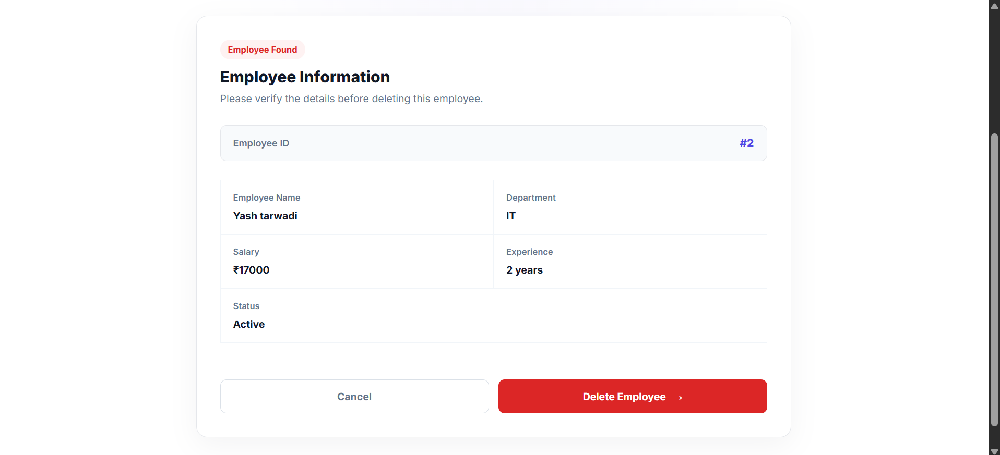

# SyncWork - Employee Management System

SyncWork is a web-based Employee Management System built using Java, Spring Boot, Spring MVC, JSP, Hibernate, and MySQL.

The application provides a professional interface for managing employee records along with user registration, login, logout, session-based authentication, and AOP-based access control.

---

## 🚀 Features

### 🔐 Authentication

- User Registration
- User Login
- User Logout
- Session-based authentication
- Login protection using Spring AOP
- Authentication error handling
- Success and error messages

### 👨‍💼 Employee Management

- Add new employees
- View all employees
- Search employees by department
- Update employee information
- Delete employee records
- Employee status management
- Department management
- Salary management
- Experience management

### ✅ Validation

- Employee name validation
- Salary validation
- Experience validation
- User registration validation
- Login validation
- Success and error response handling

### 🎨 User Interface

- Professional and responsive UI
- JSP-based frontend
- Common navigation bar
- Dedicated success and error message pages
- Clean employee management interface

---

## 🛠️ Technologies Used

- Java
- Spring Boot
- Spring MVC
- Spring AOP
- JSP
- JSTL
- Hibernate
- Spring Data JPA
- MySQL
- HTML5
- CSS3
- Maven
- Eclipse IDE

---

## 🔐 Authentication Flow

SyncWork provides a basic authentication system to protect employee management operations.

### Registration

New users can create an account by providing the required information.

### Login

Registered users can log in using their username and password.

### Session Management

After successful login, the user session is created and the logged-in user is stored in the HTTP session.

### AOP Login Protection

Spring AOP is used to check whether a user is logged in before accessing protected employee management operations.

### Logout

Users can log out of the application, which invalidates the current session.

---

## 📌 Project Modules

### 🔐 User Registration

Allows new users to create an account.


### 🔑 User Login

Allows registered users to securely log in to the SyncWork system.


### 🏠 Dashboard

The dashboard provides an overview of the SyncWork Employee Management System and provides quick access to employee management operations.



### ➕ Add Employee

Allows users to add a new employee with the following information:

- Employee Name
- Department
- Salary
- Experience
- Employee Status



### 👥 View Employees

Displays all employees stored in the database.

The employee table includes:

- Employee ID
- Employee Name
- Department
- Salary
- Experience
- Status
- Update
- Delete



### 🔎 Search Employee

Employees can be filtered by department.

Available departments include:

- IT
- HR
- Testing
- Marketing
- Sales



### ✏️ Update Employee

Allows users to update existing employee information.



### 🗑️ Delete Employee

The delete operation first finds the employee by ID and displays the employee information before deletion.



---

## ✅ Validation

### Employee Name

- Minimum 2 characters
- Maximum 50 characters
- Letters and spaces are allowed

### Salary

- Salary must be greater than ₹15,000

### Experience

- Experience cannot be negative
- Maximum experience allowed is 10 years

### Authentication

- Username validation
- Password validation
- Registration validation
- Login validation

---

## 🗄️ Database

The application uses MySQL for storing user and employee information.

### User Table

The user records contain authentication-related information required for registration and login.

### Employee Table

The employee records contain information such as:

- Employee ID
- Employee Name
- Department
- Salary
- Experience
- Status

Hibernate and Spring Data JPA are used to communicate with the MySQL database.

---

## 🔄 Application Flow

### Authentication Flow

```text
User
  ↓
JSP Login/Register
  ↓
Spring MVC Controller
  ↓
Service Layer
  ↓
Repository
  ↓
Hibernate / JPA
  ↓
MySQL Database
---

## 📂 Project Structure

```text
src
 └── main
     ├── java
     │   └── com.tka
     │       ├── aspect
     │       │   └── LoginCheckAspect.java
     │       │
     │       ├── controller
     │       │   ├── EmployeeController.java
     │       │   └── UserController.java
     │       │
     │       ├── service
     │       │   ├── employeeService.java
     │       │   └── UserService.java
     │       │
     │       ├── repository
     │       │   ├── EmployeeRepository.java
     │       │   └── UserRepository.java
     │       │
     │       └── entity
     │           ├── Employee.java
     │           └── User.java
     │
     ├── resources
     │   └── application.properties
     │
     └── webapp
         ├── css
         │   ├── add-employee.css
         │   ├── delete-employee.css
         │   ├── delete-employee-form.css
         │   ├── get-employee.css
         │   ├── home.css
         │   ├── login-user.css
         │   ├── register-user.css
         │   ├── update-employee.css
         │   ├── update-employee-form.css
         │   └── validation-message.css
         │
         ├── images
         │   └── favicon.ico
         │
         └── WEB-INF
             └── views
                 ├── common
                 │   └── navbar.jsp
                 │
                 ├── home.jsp
                 ├── login-user.jsp
                 ├── register-user.jsp
                 ├── add-employee.jsp
                 ├── get-employee.jsp
                 ├── update-employee.jsp
                 ├── update-employee-form.jsp
                 ├── delete-employee.jsp
                 ├── delete-employee-form.jsp
                 ├── success-message.jsp
                 └── error-message.jsp
```

---

## ⚙️ How to Run

### 1. Clone the Repository
```bash
git clone 
```

### 2. Open the Project
Open the project in Eclipse IDE as a Maven project.

### 3. Configure MySQL
Create a MySQL database and update the database configuration in `application.properties`:
```properties
spring.datasource.url=jdbc:mysql://localhost:3306/syncwork_db
spring.datasource.username=root
spring.datasource.password=your_password
spring.jpa.hibernate.ddl-auto=update
spring.jpa.show-sql=true
```

### 4. Run the Application
Run the Spring Boot application using your IDE.

### 5. Open in Browser
```text
http://localhost:8080/employee-managment-system/home
```

---

🔒 Security & Access Control

The application uses session-based authentication to manage logged-in users.

Spring AOP is implemented to provide centralized login checking for protected operations.

This approach keeps authentication logic separate from individual controller methods and makes the application easier to maintain.

---

🎯 Future Improvements
Role-based access control
Admin and Employee roles
Pagination
Advanced employee search
Sorting and filtering
Employee profile page
Dashboard statistics
REST API integration
React frontend
Improved exception handling
Password encryption
Improved application security

---

📈 Future Development

SyncWork is being developed as a learning project while progressing toward full-stack Java development.

Planned technologies and improvements include:

Core Java
    ↓
JDBC
    ↓
Servlet
    ↓
JSP
    ↓
Spring MVC
    ↓
Spring Boot
    ↓
Hibernate / JPA
    ↓
REST API
    ↓
React
    ↓
Full Stack Development

---

## 👨‍💻 Author

**Harshal Patil**  
*Java & Full Stack Development Learner*  

---

⭐ Support
⭐ If you find this project useful, consider giving the repository a star on GitHub.

---

📄 License
This project is created for learning and development purposes.
